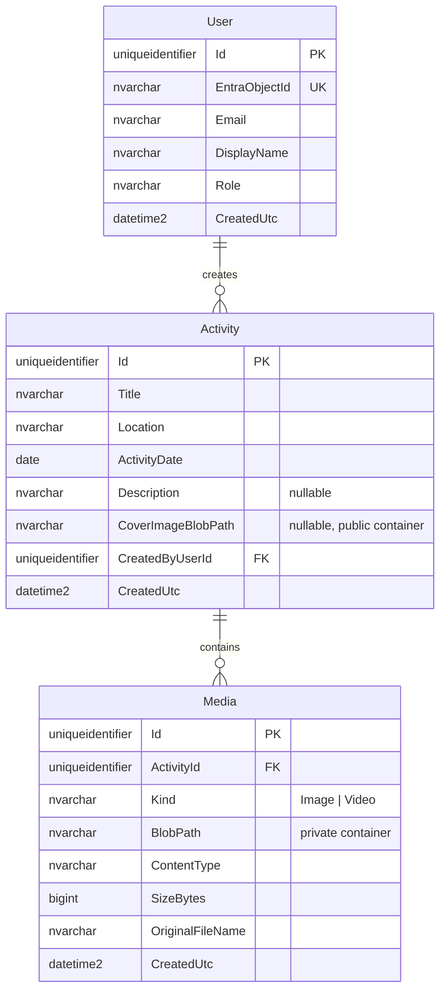

# PRD — TrailBlaze Activity Journal

Status: **Draft** (captured from requirements-grilling session, 2026-09-15)
Owner: TBD

## Vision

A public-read **activity journal**. Anyone can browse a list of activities ordered by date
descending — title, location, date, and a cover image. Signing in reveals the media each
activity carries: images and videos uploaded by the person who logged it.

TrailBlaze is one **shared journal**, not a set of private diaries. Everyone posts to the same
feed. Ownership decides who may *edit* an entry, not who may *read* it.

## Stakeholders

- **Visitor (anonymous)** — browses the activity list and reads activity text; sees cover
  images; cannot see activity media and cannot post.
- **User (signed in)** — everything a visitor can do, plus: views every activity's images and
  videos, creates activities, and edits or deletes their own.
- **Admin (signed in)** — everything a user can do, plus: edits or deletes *any* activity. Has
  no separate screens; the role is purely elevated rights in the same UI.

## System overview

| Component | Tech | Responsibility |
|---|---|---|
| Web app | React 19 (Vite) + TypeScript + Tailwind, exported from **Figma Make** | Single role-gated app: the public activity list, activity detail with media, and the create/edit form. Auth via MSAL. |
| Backend | ASP.NET Core 10 | REST + OAuth 2.0 bearer; activities CRUD; media upload; SAS URL issuance; authn/authz |
| Database | SQL Server | Users, activities, media metadata. Binary media lives in Azure Blob, never in the DB. |
| Blob storage | Azure Blob Storage | Two containers: a **public** one for cover images, a **private** one for activity media. |
| Identity | Entra ID | Sign-in, bearer tokens, role claims |

The backend is a layered solution under `src/api/` — `TrailBlaze.Model`, `TrailBlaze.Repository`,
`TrailBlaze.Service`, `TrailBlaze.Interface`, `TrailBlaze.Api` — each layer carrying a sibling
xUnit test project. Test command: `dotnet test` (from `src/api/`).

Deployment (stage 1): **local Docker**. `docker-compose` runs the backend and a SQL Server
container; the web app joins at frontend integration. Azure Blob and Entra ID are **real cloud
resources** in every environment, including development.

## Frontend build

UI screens are authored in **Figma Make**, which exports a React project used from `src/web/`.
The only hand-written frontend work is **integrating the exported app with the backend API** —
MSAL auth wiring, API calls, wiring responses into the exported components, and role gating.
Per [testing-and-tdd.md](testing-and-tdd.md), the frontend is **out of TDD scope**; consequently
every feature below specs the **backend/API slice** the exported UI calls, not screens or widgets.

## Decisions log

Every requirement decision from the grilling session, in order:

| # | Decision | Resolution |
|---|---|---|
| 1 | What the product is | An **activity journal**: a user browses activities ordered by date descending and attaches images/videos to each |
| 2 | Audience for activity text vs media | **List and descriptions are public**; **images and videos require sign-in** |
| 3 | Is it one journal or many | **One shared journal** — everyone posts to one feed; ownership governs edit/delete only |
| 4 | Media storage | **Azure Blob Storage** (not local disk, not the database) |
| 5 | Blob endpoint per environment | **Real Azure Storage account for everything**, dev and tests included |
| 6 | Tests vs. the live Azure dependency | **Fake `IStorageService` in unit tests**; a separate integration tier exercises real Azure |
| 7 | How media reaches the browser | **Short-lived SAS URLs** issued by an authenticated endpoint; container stays private |
| 8 | Authentication | **Entra ID** |
| 9 | Roles | **User + Admin**; admin can edit/delete any activity |
| 10 | Which date drives the sort | **User-chosen activity date**; backdating allowed; a `CreatedUtc` is kept for audit only |
| 11 | Activity fields | `Date`, `Location`, `Title`, `Description` (optional), `CoverImage` (optional) |
| 12 | Location capture | **Free-text place name** — no lookup, no structured fields |
| 13 | Cover image audience | **Always public** — an explicit exception to the media rule |
| 14 | Where the cover comes from | **Its own upload** into the public container; never picked from private media |
| 15 | Video handling | **Store as-is**; validate content type and size; no transcoding, no thumbnails |
| 16 | Backend & data stack | **.NET 10 layered + SQL Server** (swapped from the inherited PostgreSQL) |
| 17 | Where the UI comes from | **Figma Make export**, as in the source project; frontend not test-first |
| 18 | Feature ladder | **Written fresh for TrailBlaze** — the inherited ladder described a dynamic-form platform |
| 19 | Repository | **New GitHub repository** (`github.com/RhaegarC`), `develop` integration / `master` production |
| 20 | Scaffolding adaptation | **Full adaptation** of `.claude/` plus `PRD.md`, `testing-and-tdd.md`, `features/` as foundation work |
| 21 | Admin surface | **Elevated rights only** — no dedicated admin screens |
| 22 | Backend vs. frontend sequencing | **API-first**; Figma integration is its own late feature |
| 23 | Public list behaviour | **Paginated, date-descending, no search** |
| 24 | Upload limits | **~20 media per activity**, images ≤ 10 MB, videos ≤ 200 MB |
| 25 | Date representation | **Calendar date only** — no time, no timezone, no UTC-midnight conversion |

## Data model

| Table | Column | Type | Notes |
|---|---|---|---|
| `users` | `Id` | uniqueidentifier | PK |
| | `EntraObjectId` | nvarchar(64) | unique — the Entra `oid` claim |
| | `Email` | nvarchar(320) | from the token |
| | `DisplayName` | nvarchar(200) | from the token |
| | `Role` | nvarchar(16) | `User` \| `Admin` |
| | `CreatedUtc` | datetime2 | auto-provisioned on first authenticated request |
| `activities` | `Id` | uniqueidentifier | PK |
| | `Title` | nvarchar(200) | required |
| | `Location` | nvarchar(200) | required, free text |
| | `ActivityDate` | date | required; **calendar date, no time**; drives the sort |
| | `Description` | nvarchar(max) | optional |
| | `CoverImageBlobPath` | nvarchar(512) | optional; **public** container |
| | `CreatedByUserId` | uniqueidentifier | FK → `users.Id` |
| | `CreatedUtc` | datetime2 | audit + same-day sort tiebreaker |
| `media` | `Id` | uniqueidentifier | PK |
| | `ActivityId` | uniqueidentifier | FK → `activities.Id`, cascade delete |
| | `Kind` | nvarchar(16) | `Image` \| `Video` |
| | `BlobPath` | nvarchar(512) | **private** container; served only via SAS |
| | `ContentType` | nvarchar(128) | validated allowlist |
| | `SizeBytes` | bigint | validated ≤ 10 MB image / ≤ 200 MB video |
| | `OriginalFileName` | nvarchar(260) | display only |
| | `CreatedUtc` | datetime2 | |

**Schema-change discipline.** A feature that changes the data model updates the table above in
the same PR. `docs/PRD.md#data-model` (this section) is the canonical reference.

## Authentication & authorization

Entra ID issues the bearer token; the API validates it and auto-provisions a `users` row on
first sight of a new `oid`. Role comes from the `Role` column, not from a token claim alone —
the platform issues the token, the database decides the privilege. Exactly one admin is seeded
at startup.

| Operation | Anonymous | User | Admin |
|---|---|---|---|
| `GET /api/activities` (list) | ✅ | ✅ | ✅ |
| `GET /api/activities/{id}` (text + cover) | ✅ | ✅ | ✅ |
| `GET /api/activities/{id}/media` (metadata) | ❌ 401 | ✅ | ✅ |
| `GET /api/media/{id}/url` (SAS) | ❌ 401 | ✅ | ✅ |
| `POST /api/activities` | ❌ 401 | ✅ | ✅ |
| `PUT /api/activities/{id}` | ❌ 401 | own only (403 otherwise) | ✅ |
| `DELETE /api/activities/{id}` | ❌ 401 | own only (403 otherwise) | ✅ |
| `POST /api/activities/{id}/cover` | ❌ 401 | own only | ✅ |
| `POST /api/activities/{id}/media` | ❌ 401 | own only | ✅ |
| `DELETE /api/media/{id}` | ❌ 401 | own only | ✅ |

**Default deny.** Anonymous access is the exception, granted deliberately on exactly two read
endpoints. Ownership checks live in one service so the rule is enforced in one place.

## Media storage & delivery

Two containers, two security stories, deliberately never connected:

- **`covers` (public)** — cover images. World-readable by design, so the public list renders
  with images for anonymous visitors. Served as plain blob URLs.
- **`media` (private)** — the images and videos belonging to an activity. Never public. The
  browser obtains bytes only through a **short-lived SAS URL** minted by an authenticated
  endpoint.

The cover is **its own upload** and never derived from private media. This is the design's
load-bearing rule: it makes promoting a private blob to public impossible by construction.

Because a SAS URL is a bearer token, the **expiry window is the real control**, not the URL's
secrecy. Unauthenticated requests to the SAS endpoint must fail with 401 before any blob
operation is attempted.

Validation on upload: content type against an allowlist, size against the caps in Decision #24,
and a count check against the activity's existing media.

## API surface

| Method | Route | Auth | Purpose |
|---|---|---|---|
| `GET` | `/api/activities?page=&pageSize=` | anonymous | Paged list, date descending |
| `GET` | `/api/activities/{id}` | anonymous | Activity text + cover |
| `POST` | `/api/activities` | user | Create |
| `PUT` | `/api/activities/{id}` | owner/admin | Update |
| `DELETE` | `/api/activities/{id}` | owner/admin | Delete (cascades media) |
| `POST` | `/api/activities/{id}/cover` | owner/admin | Upload/replace cover → public container |
| `GET` | `/api/activities/{id}/media` | user | Media metadata for the activity |
| `POST` | `/api/activities/{id}/media` | owner/admin | Upload image/video → private container |
| `GET` | `/api/media/{id}/url` | user | Mint a short-lived SAS URL |
| `DELETE` | `/api/media/{id}` | owner/admin | Delete media (row + blob) |
| `GET` | `/health` | anonymous | Liveness |

`pageSize` is capped server-side (default 20, max 100) so the endpoint cannot be made to return
an unbounded result set.

## Deployment (stage 1)

**Local Docker**, no reverse proxy — `docker-compose` brings up the API and SQL Server. Azure
Blob and Entra ID are real cloud resources reached by configuration, so secrets live in user
secrets locally and in CI variables for the pipeline. EF migrations run at startup.

## Out of scope / deferred

- **Search and filtering** on the list (Decision #23 — pagination only for v1)
- **Video transcoding and poster thumbnails** (Decision #15) — be aware that an iPhone's HEVC
  `.mov` will not play in Chrome or Firefox; it is stored faithfully and simply won't render
- **Per-media visibility** — the public/private split is per *class*, not per item (Decisions #13/#14)
- **Comments, likes, follows, or any social layer**
- **Dedicated admin screens** (Decision #21)
- **Multi-tenancy** — one journal, everyone sees the same feed
- **Offline support / native mobile apps**
- **The inherited dynamic-form features** — conditional fields, remote lookups, and form config
  with live preview have no analogue in TrailBlaze (Decision #18) and are dropped, not deferred
