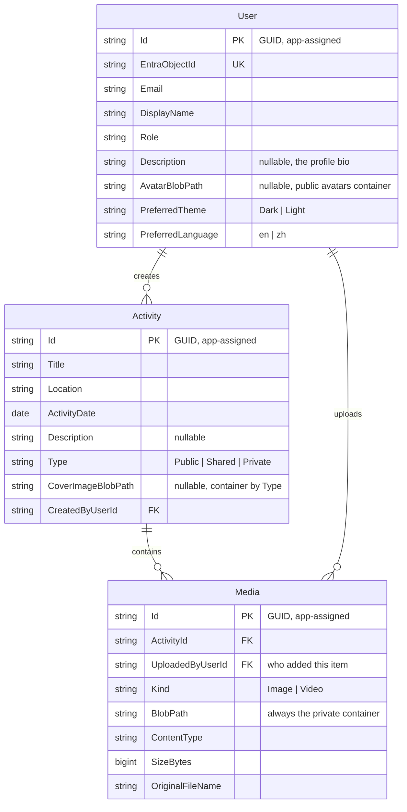

# PRD — TrailBlaze Activity Journal

Status: **Draft** (captured from requirements-grilling session, 2026-09-15)
Owner: TBD

## Vision

An **activity journal** with per-entry visibility. Anyone can browse the list of **Public**
activities ordered by date descending — title, location, date, and a cover image. Signing in
reveals the media those activities carry and adds the entries their owners marked **Shared**
(signed-in users only). Entries marked **Private** are visible to their owner alone.

TrailBlaze is one **shared journal**, not a set of private diaries: everyone posts to the same
feed, and the visibility control exists so that some entries can be held back rather than so that
each user gets their own. Visibility decides who may *read* an entry; ownership decides who may
*edit* it. Media is collaborative — a signed-in user who can see an activity may add their own
photos and videos to it, and each item records who uploaded it.

## Stakeholders

- **Visitor (anonymous)** — browses the list of **Public** activities and reads their text; sees
  their cover images; cannot see activity media, cannot see Shared or Private entries, and
  cannot post.
- **User (signed in)** — everything a visitor can do, plus: sees **Shared** entries and their
  own **Private** ones; views every visible activity's images and videos; creates activities;
  adds media to any activity they can see; edits or deletes their own; and maintains their own
  profile (display name, bio, avatar, theme, language).
- **Admin (signed in)** — everything a user can do, plus: sees, edits, or deletes *any*
  activity regardless of visibility. Has no separate screens; the role is purely elevated rights
  in the same UI.

## System overview

| Component | Tech | Responsibility |
|---|---|---|
| Web app | React 19 (Vite) + TypeScript + Tailwind, exported from **Figma Make** | Single role-gated app: the public activity list, activity detail with media, and the create/edit form. Auth via MSAL. |
| Backend | ASP.NET Core 10 | REST + OAuth 2.0 bearer; activities CRUD; media upload; SAS URL issuance; authn/authz |
| Database | **Azure SQL Server** | Users, activities, media metadata. Binary media lives in Azure Blob, never in the DB. |
| Blob storage | Azure Blob Storage | Three containers, each with one security story: **public** `covers` (covers of Public activities), **public** `avatars` (user avatars), **private** `media` (activity media, plus covers of Shared and Private activities). |
| Identity | Entra ID | Sign-in, bearer tokens, role claims |

The backend is a layered solution under `src/api/` — `TrailBlaze.Model`, `TrailBlaze.Repository`,
`TrailBlaze.Service`, `TrailBlaze.Interface`, `TrailBlaze.Api` — each layer carrying a sibling
xUnit test project. The solution file is `src/api/TrailBlaze.slnx`; the test projects are
`TrailBlaze.Api.Test`, `TrailBlaze.Repository.Test`, and `TrailBlaze.Service.Test`. Test command:
`dotnet test` (from `src/api/`).

Data conventions — application-assigned string GUID keys, soft delete, and the audit trail — are
specified in [src/api/STANDARD.md](../src/api/STANDARD.md) §3 and §10, and enforced by
`EntityBase` plus the save interceptor. This PRD states *what* the data holds; STANDARD.md states
*how* it is shaped.

Deployment: the API runs on **Azure Container Apps** from the image `src/api/Dockerfile` builds;
the web app runs on **Azure Static Web Apps**, deployed by GitHub workflow. There is no
`docker-compose.yml` — neither target consumes a multi-service local stack, so there is none.
Azure SQL Database, Azure Blob and Entra ID are **real cloud resources** in every environment,
including development and tests — nothing is emulated locally.

### Current state vs. target

This PRD describes the **target** product. The code is built up to it feature by feature
(`docs/features/`), so the two differ today. Each difference is a deliberate, sequenced gap — not
drift — and each is tracked below. Anything not listed here is expected to match the code.

**Built ahead of the ladder.** The repository started from a generic layered .NET scaffold, so
some work the ladder attributes to features 01–02 already exists:

| Already in the code | Where |
|---|---|
| Entra ID bearer-token validation, wired only when `TenantId` and `Audience` are both configured; anonymous otherwise, with a startup warning saying so | `TrailBlaze.Api/ServiceExt.cs`, `Program.cs` |
| Caller auto-provisioning — `GET /user/me` inserts the caller's row on first authenticated call | `UserService.GetOrCreateAsync`, `UserController` |
| `GET /health` and an OpenAPI document (development only) | `Program.cs` |
| Application-assigned GUID keys, soft delete, and the append-only audit trail | `EntityBase`, `AuditSaveChangesInterceptor`, `AuditLog` |

**Not yet built.** These are the real gaps:

| Area | Target (this document) | Code today | Closes in |
|---|---|---|---|
| Database engine | **Azure SQL Server** | **done** — `Microsoft.EntityFrameworkCore.SqlServer`; migrations and snapshot regenerated on SQL Server | feature 01 |
| API hosting | ACA from a container image | **done** — `src/api/Dockerfile` builds the image, `.dockerignore` keeps local build output out of the context. No `docker-compose.yml`: neither target needs a local multi-service stack | feature 01 |
| Web hosting | Azure Static Web Apps by GitHub workflow | not built | feature 10 |
| Test harness | xUnit per layer, no-database pattern ([testing-and-tdd.md](testing-and-tdd.md)) | **done** — the three `*.Test` projects reference the layer each exercises; `dotnet test` discovers 31 tests | feature 01 |
| Blob abstraction | `IStorageService` with an in-memory fake, three containers | **done** — `IStorageService` in `TrailBlaze.Interface`, an Azure adapter in `TrailBlaze.Repository`, and the fake in `TrailBlaze.Service.Test` | feature 01 |
| Activity and media tables | the data model below | only `users` and the audit table exist | feature 04 |
| Profile columns | `users` carries `Description`, `AvatarBlobPath`, `PreferredTheme`, `PreferredLanguage`, `Email` | `users` carries only `DisplayName`, `Role`, `Description` | feature 02 |
| Profile API | `PUT /user/me`, `POST`/`DELETE /user/me/avatar` | `UserController` exposes `GET me` only | feature 02 |
| Frontend integration | the Figma export wired to the API (feature 10) | the export is committed but is **entirely mock data** — no API call, no MSAL, the role hard-coded to `user` and upload controls inert. It is design intent, not a working client | feature 10 |

**One divergence needs a decision, not a fix.** The data model below gives `users` a surrogate
`Id` plus a separate unique `EntraObjectId`. The code instead uses the Entra object id **as** the
primary key (`User.Id = entraObjectId`) and has no `EntraObjectId` column. Both are defensible:
the code's version is simpler and the `oid` is immutable in Entra, while this document's version
keeps the key opaque and leaves room for a user row that exists before its owner ever signs in.
Pick one and make the other side match it — until then, read the data model below as a proposal
rather than a description. This is the one row here that a doc edit cannot close.

That decision now has a security consequence it did not have before. Under the code's shape the
`users` primary key **is** the Entra object id, so any response carrying a user id hands the
recipient a durable Entra identifier. Decision #30 therefore forbids the anonymous payload from
carrying one: anonymous responses name the creator by display name only, and the id travels only
on authenticated responses. If the surrogate-key shape wins, this stops being load-bearing — but
it should stay in place either way, because the anonymity of the payload should not depend on
which shape the primary key happens to take.

## Frontend build

UI screens are authored in **Figma Make**, which exports a React project used from `src/web/`.
The only hand-written frontend work is **integrating the exported app with the backend API** —
MSAL auth wiring, API calls, wiring responses into the exported components, and role gating.
Per [testing-and-tdd.md](testing-and-tdd.md), the frontend is **out of TDD scope**; consequently
every feature below specs the **backend/API slice** the exported UI calls, not screens or widgets.

## Decisions log

Every requirement decision from the grilling session, in order:

| # | Decision | Resolution |
|---|---|---|
| 1 | What the product is | An **activity journal**: a user browses activities ordered by date descending and attaches images/videos to each |
| 2 | Audience for activity text vs media | **Activity text is public or restricted by the entry's visibility** (see #26); **images and videos always require sign-in** — this half is unchanged and applies at every visibility level |
| 3 | Is it one journal or many | **One shared journal** — everyone posts to one feed; visibility governs who may read an entry, ownership governs who may edit it. Private entries are an escape hatch within the shared feed, not private journals (see #26) |
| 4 | Media storage | **Azure Blob Storage** (not local disk, not the database) |
| 5 | Blob endpoint per environment | **Real Azure Storage account for everything**, dev and tests included |
| 6 | Tests vs. the live Azure dependency | **Fake `IStorageService` in unit tests**; a separate integration tier exercises real Azure |
| 7 | How media reaches the browser | **Short-lived SAS URLs** issued by an authenticated endpoint; container stays private |
| 8 | Authentication | **Entra ID** |
| 9 | Roles | **User + Admin**; admin can edit/delete any activity |
| 10 | Which date drives the sort | **User-chosen activity date**; backdating allowed; a `CreatedOn` audit timestamp is kept as the tiebreaker |
| 11 | Activity fields | `Date`, `Location`, `Title`, `Description` (optional), `CoverImage` (optional), `Type` (visibility, see #26) |
| 12 | Location capture | **Free-text place name** — no lookup, no structured fields |
| 13 | Cover image audience | **Follows the activity's visibility** — public for a Public activity, SAS-only for Shared and Private ones (see #29). Supersedes the earlier "always public", which held only while every activity was public |
| 14 | Where the cover comes from | **Its own upload** into a container chosen by the activity's visibility; never picked from, derived from, or re-pointed at private media (see #29) |
| 15 | Video handling | **Store as-is**; validate content type and size; no transcoding, no thumbnails |
| 16 | Backend & data stack | **.NET 10 layered + Azure SQL Server** (swapped from the inherited PostgreSQL in feature 01; the swap is done) |
| 17 | Where the UI comes from | **Figma Make export**, as in the source project; frontend not test-first |
| 18 | Feature ladder | **Written fresh for TrailBlaze** — the inherited ladder described a dynamic-form platform |
| 19 | Repository | **New GitHub repository** (`github.com/RhaegarC`), `develop` integration / `master` production |
| 20 | Scaffolding adaptation | **Full adaptation** of `.claude/` plus `PRD.md`, `testing-and-tdd.md`, `features/` as foundation work |
| 21 | Admin surface | **Elevated rights only** — no dedicated admin screens |
| 22 | Backend vs. frontend sequencing | **API-first**; Figma integration is its own late feature |
| 23 | Public list behaviour | **Paginated, date-descending, no search** |
| 24 | Upload limits | **~20 media per activity**, images ≤ 10 MB, videos ≤ 200 MB |
| 25 | Date representation | **Calendar date only** — no time, no timezone, no UTC-midnight conversion |
| 26 | Per-activity visibility | **`Type` ∈ {`Public`, `Shared`, `Private`}**, required, defaulting to `Public`. `Public` = anonymous may read; `Shared` = signed-in users only; `Private` = the owner only (and admins). Visibility gates **reading**; it never gates media, which needs sign-in at every level (#2). Added from the Figma export, 2026-09-15 — this supersedes the earlier flat "everything is public-read" model and reverses the earlier rejection of private entries in the shared feed, which was rejected on the assumption that private meant *separate journals* |
| 27 | Media is collaborative | **Any signed-in user who can see an activity may add media to it**, not only its owner. Each `media` row records its **uploader**, and the detail view groups items by uploader. Deletion is allowed to the **uploader, the activity's owner, or an admin**. The 20-per-activity cap (#24) is unchanged and counts the activity's items regardless of uploader |
| 28 | User profile & preferences | **Display name, bio, avatar, theme and language are stored server-side per user** and edited on a profile screen. Avatar lives in the **public** `avatars` container. Theme ∈ {`Dark`, `Light`}, language ∈ {`en`, `zh`}; both are presentation preferences and carry no authorization meaning |
| 29 | Cover container follows visibility | A cover is uploaded **directly into the container its activity's visibility requires**: `covers` (public) for a Public activity, `media` (private, SAS-served) for Shared and Private ones. Changing an activity's `Type` across that line **moves the cover** — see "Media storage & delivery". #14's rule that a cover is its own upload and is never derived from private media stands unchanged |
| 30 | Anonymous payload scope | The anonymous response may carry the activity's **media count** and its **creator's display name**. It may **not** carry a user id, a blob path, a SAS URL, or any per-item media field. Relaxes the stricter rule feature 05 originally stated, which forbade the count as media-derived |

## Data model

Every entity derives from **`EntityBase`**, so the shared columns below are present on all three
tables. They are drawn once, here, rather than repeated in the diagram:

| Column | Type | Notes |
|---|---|---|
| `Id` | string (GUID) | PK — **assigned by the application at construction**, not by the database |
| `CreatedBy` | string, nullable | caller identity at insert |
| `CreatedOn` | datetimeoffset | set at insert, then immutable. Not yet stamped on every write path — see STANDARD.md §12 |
| `LastModifiedBy` | string, nullable | caller identity at the last update |
| `LastModifiedOn` | datetimeoffset | set at insert and on every update |
| `IsDeleted` | bit, nullable | soft delete — a global query filter hides `true` rows by default |

The `users` row is the one exception to the `Id` rule: see the open key-shape decision below the
current-state table.

| Table | Column | Type | Notes |
|---|---|---|---|
| `users` | `Id` | string (GUID) | PK, app-assigned |
| | `EntraObjectId` | nvarchar(64) | unique — the Entra `oid` claim |
| | `Email` | nvarchar(320) | from the token |
| | `DisplayName` | nvarchar(200) | from the token, then edited on the profile screen |
| | `Role` | nvarchar(16) | `User` \| `Admin` |
| | `Description` | nvarchar(500) | nullable; the profile **bio**, user-edited |
| | `AvatarBlobPath` | nvarchar(512) | nullable; **public** `avatars` container |
| | `PreferredTheme` | nvarchar(16) | `Dark` \| `Light`; default `Dark`; presentation only |
| | `PreferredLanguage` | nvarchar(16) | `en` \| `zh`; default `en`; presentation only |
| `activities` | `Id` | string (GUID) | PK, app-assigned |
| | `Title` | nvarchar(200) | required |
| | `Location` | nvarchar(200) | required, free text |
| | `ActivityDate` | date | required; **calendar date, no time**; drives the sort |
| | `Description` | nvarchar(max) | optional |
| | `Type` | nvarchar(16) | `Public` \| `Shared` \| `Private`; required, defaults to `Public`; **gates reads** |
| | `CoverImageBlobPath` | nvarchar(512) | optional; container follows `Type` — `covers` (public) for `Public`, `media` (private, SAS) for `Shared`/`Private` |
| | `CreatedByUserId` | string (GUID) | FK → `users.Id` |
| `media` | `Id` | string (GUID) | PK, app-assigned |
| | `ActivityId` | string (GUID) | FK → `activities.Id` |
| | `UploadedByUserId` | string (GUID) | FK → `users.Id`; **who added this item** — not necessarily the activity's creator |
| | `Kind` | nvarchar(16) | `Image` \| `Video` |
| | `BlobPath` | nvarchar(512) | **private** container; served only via SAS. Also holds covers of Shared/Private activities |
| | `ContentType` | nvarchar(128) | validated allowlist |
| | `SizeBytes` | bigint | validated ≤ 10 MB image / ≤ 200 MB video |
| | `OriginalFileName` | nvarchar(260) | display only |

Five consequences follow from the conventions above, and features below depend on them:

- **The sort tiebreaker is `CreatedOn`** (from `EntityBase`), not a column of its own. Ordering is
  `ActivityDate DESC, CreatedOn DESC` (Decision #10, feature 05).
- **Keys are strings the application assigns**, so an entity has its id before it is saved. This
  is what lets the audit trail record an `EntityId` on insert.
- **Deletes are soft.** `DELETE /api/activities/{id}` and `DELETE /api/media/{id}` mark rows
  `IsDeleted`; the global query filter removes them from every read path.
- **Visibility is a column, and it gates every read.** `activities.Type` is evaluated against the
  caller on the list *and* on the detail read. An activity the caller may not see is returned as
  **404, not 403** — a 403 would confirm the row exists, which is itself the fact being withheld.
  Mutations keep the 403 (see "Authentication & authorization").
- **Media belongs to an activity, not to a person.** `media.UploadedByUserId` exists to group and
  attribute items and to decide who may delete one; it never widens or narrows visibility, which
  is the activity's `Type` alone.

`AuditLog` is the one table that does **not** derive from `EntityBase`: it is append-only and
records `EntityId` as a plain string, because it must outlive the row it describes.

**Schema-change discipline.** A feature that changes the data model updates the table above in
the same PR. `docs/PRD.md#data-model` (this section) is the canonical reference.

## Authentication & authorization

Entra ID issues the bearer token; the API validates it and auto-provisions a `users` row on
first sight of a new `oid`. Role comes from the `Role` column, not from a token claim alone —
the platform issues the token, the database decides the privilege. Exactly one admin is seeded
at startup.

Authorization has two independent axes, and keeping them apart is what makes the matrix readable:
**visibility** (`activities.Type`) decides who may *read* an entry; **ownership**
(`activities.CreatedByUserId`) decides who may *mutate* it. An admin overrides both.

**Reading — what a caller receives, by the activity's `Type`:**

| `Type` | Anonymous | Signed-in non-owner | Owner | Admin |
|---|---|---|---|---|
| `Public` | text + cover + media count + creator display name | text + cover + media | full | full |
| `Shared` | **404** | text + cover + media | full | full |
| `Private` | **404** | **404** | full | full |

"Media count" and "creator display name" are the full extent of what an anonymous caller receives
beyond the text and cover (Decision #30): no user id, no blob path, no SAS URL, and no per-item
media field. The count and the name are what the export's list rows display; the ids behind them
are not.

`GET /api/activities` applies the same rule as a *filter* rather than a 404: an anonymous caller
pages the Public entries, a signed-in caller pages Public + Shared + their own Private, and an
admin pages everything.

**Mutating:**

| Operation | Anonymous | Signed-in non-owner | Owner | Admin |
|---|---|---|---|---|
| `POST /api/activities` | ❌ 401 | ✅ 201 | ✅ 201 | ✅ 201 |
| `PUT /api/activities/{id}` | ❌ 401 | ❌ 403 | ✅ 200 | ✅ 200 |
| `DELETE /api/activities/{id}` | ❌ 401 | ❌ 403 | ✅ 204 | ✅ 204 |
| `POST /api/activities/{id}/cover` | ❌ 401 | ❌ 403 | ✅ 200 | ✅ 200 |
| `POST /api/activities/{id}/media` | ❌ 401 | ✅ 201 if they can read the activity, ❌ **404** if not | ✅ 201 | ✅ 201 |
| `DELETE /api/media/{id}` | ❌ 401 | ✅ 204 **if they uploaded it**, ❌ 403 otherwise | ✅ 204 | ✅ 204 |
| `PUT /user/me`, `POST` / `DELETE /user/me/avatar` | ❌ 401 | ✅ self only — ❌ 403 for any other user | ✅ self only | ✅ self only |

Media mutation is the one place the two axes cross: **any signed-in user who can see an activity
may add media to it** (Decision #27), so the check is visibility, not ownership — except on a
Private activity they do not own, which they cannot see and therefore cannot contribute to.
`GET /api/activities/{id}/media` and `GET /api/media/{id}/url` return **401** anonymously and
**404** for a signed-in caller who cannot read the activity, so the media surface cannot be used
to probe for a Private entry's existence.

**Default deny.** Anonymous access is the exception, granted deliberately on exactly two read
endpoints. **404 and 403 are not interchangeable**: a caller who may not *see* an activity gets
404, because "this row exists" is itself the fact being withheld; a caller who can see it but may
not act on it gets 403. Visibility and ownership checks live in one service so the rule is
enforced in one place.

## Media storage & delivery

Three containers, each holding exactly one class of bytes, so that "is this blob public?" is
answerable from the container name alone:

- **`covers` (public)** — covers of **Public** activities. World-readable by design, so the
  anonymous list renders with images. Served as plain blob URLs.
- **`avatars` (public)** — user avatars. World-readable, plain blob URLs; an avatar is a
  deliberately public identity (Decision #28).
- **`media` (private)** — every activity's images and videos, **plus the covers of Shared and
  Private activities**. Never public. The browser obtains bytes only through a short-lived
  **SAS URL** minted by an authenticated endpoint.

**The cover follows its activity's visibility** (Decision #29). A cover is still **its own
upload** and is never derived from, picked from, or re-pointed at private media — that rule
(Decision #14) is unchanged and remains load-bearing. What changed is only *where the fresh
upload lands*, and it is a genuine fix rather than a refinement: while every activity was public,
a cover could safely go to a world-readable container. Once an activity can be Shared or Private,
a public cover URL discloses a picture from an entry the visitor cannot open.

**Changing `Type` across the public line moves the cover.** The blob's container is decided at
upload time, so an edit taking an activity from `Public` to `Shared`/`Private` must copy the
cover into `media`, update `CoverImageBlobPath`, and **delete the public blob**; the reverse move
copies it back to `covers`. This is required, not cosmetic: the old public URL is already
disclosed and may be cached or indexed, so leaving the bytes in place would keep a now-Private
entry's cover fetchable by anyone who ever saw the link. Both directions are asserted in
feature 08.

Because a SAS URL is a bearer token, the **expiry window is the real control**, not the URL's
secrecy. Unauthenticated requests to the SAS endpoint must fail with 401 before any blob
operation is attempted.

Validation on upload: content type against an allowlist, size against the caps in Decision #24,
and a count check against the activity's existing media — counted across **all** uploaders, since
media is collaborative (Decision #27).

## API surface

| Method | Route | Auth | Purpose |
|---|---|---|---|
| `GET` | `/api/activities?page=&pageSize=` | anonymous | Paged list, date descending. Anonymous callers receive **Public** entries only; a signed-in caller additionally receives **Shared** and their own **Private**. Each row is text, `Type`, media count, creator display name and a cover URL; **never** a user id, blob path or SAS URL for an anonymous caller (Decision #30) |
| `GET` | `/api/activities/{id}` | anonymous | The same payload for one entry. **404** for an entry the caller may not read |
| `POST` | `/api/activities` | user | Create — `Type` required, defaulting to `Public` |
| `PUT` | `/api/activities/{id}` | owner/admin | Update, including `Type` — crossing the public line **moves the cover** |
| `DELETE` | `/api/activities/{id}` | owner/admin | Delete (cascades media) |
| `POST` | `/api/activities/{id}/cover` | owner/admin | Upload/replace cover → `covers` (public) if the activity is `Public`, otherwise `media` (private, SAS) |
| `GET` | `/api/activities/{id}/media` | anyone who can read the activity | Media metadata, each item carrying its uploader |
| `POST` | `/api/activities/{id}/media` | any signed-in caller who can read the activity | Upload image/video → private container (collaborative, Decision #27) |
| `GET` | `/api/media/{id}/url` | anyone who can read the activity | Mint a short-lived SAS URL |
| `DELETE` | `/api/media/{id}` | uploader / activity owner / admin | Delete media (row + blob) |
| `GET` | `/user/me` | user | The caller's own row, inserted on first call — **already implemented** |
| `PUT` | `/user/me` | self | Update display name, bio, preferred theme and language |
| `POST` | `/user/me/avatar` | self | Upload/replace avatar → public `avatars` container |
| `DELETE` | `/user/me/avatar` | self | Remove the avatar (clears the field and deletes the blob) |
| `GET` | `/health` | anonymous | Liveness — **already implemented** |

`pageSize` is capped server-side (default 20, max 100) so the endpoint cannot be made to return
an unbounded result set.

**The cover URL in the two read rows is a SAS URL whenever the bytes are private.** A `Public`
activity's cover comes back as a plain public URL; a `Shared` or `Private` one comes back as a
short-lived SAS minted on the same terms as any other private blob (Decisions #13/#29) — the client
sees one field either way and never has to know which container holds the bytes. This makes the
list endpoint a **second SAS producer**, alongside `GET /api/media/{id}/url`, which is a deliberate
widening recorded in Decision #29's consequences: it means the list mints up to one SAS per
non-`Public` row per page. Both producers go through the same service method, so the TTL cap and
the read-only scope stay single-sourced (feature 07).

The `/user/...` routes are stated here in lowercase for readability; the implemented controller
uses the ASP.NET `[controller]` token, which yields `/User/me`. That casing divergence is a
known inconsistency tracked in [src/api/STANDARD.md](../src/api/STANDARD.md) §12, not a second
route.

## Deployment

**No reverse proxy, no local multi-service stack.** The API is an image on **Azure Container
Apps**, built from `src/api/Dockerfile`; the web app is a static build on **Azure Static Web
Apps**, deployed by GitHub workflow. There is no `docker-compose.yml` — neither target consumes
one, and local development is `dotnet run` against the real cloud resources.

Everything the API talks to is a real cloud resource reached by configuration: **Azure SQL
Database** (which has no container image to run locally), **Azure Blob** and **Entra ID**. Secrets
therefore live in user-secrets locally and in pipeline variables for deployment.

**Migrations are applied by the deployment pipeline, not at API startup.** Azure Container Apps runs
several replicas, and replicas migrating concurrently on startup race each other over the same DDL.
The workflow runs `dotnet ef database update` before the new revision takes traffic, so exactly one
writer touches the schema. Until those workflows exist, applying a migration is a manual step —
`DbConnection="…" dotnet ef database update` — because nothing else performs it.

## Out of scope / deferred

- **Search and filtering** on the list (Decision #23 — pagination only for v1)
- **Video transcoding and poster thumbnails** (Decision #15) — be aware that an iPhone's HEVC
  `.mov` will not play in Chrome or Firefox; it is stored faithfully and simply won't render
- **Per-media visibility** — visibility is set **per activity** (Decision #26), never per item, so
  there is no "make this one photo public" flag (Decision #14). Items inherit the activity's
  visibility; the *class*-level split now reads: public bytes are covers of Public activities and
  avatars, everything else is SAS-only
- **Comments, likes, follows, or any social layer**
- **Dedicated admin screens** (Decision #21)
- **Multi-tenancy** — one journal, everyone sees the same feed. Visibility (Decision #26)
  narrows who may read an entry; it does not partition the product into separate journals and
  adds no per-user feed
- **Offline support / native mobile apps**
- **The inherited dynamic-form features** — conditional fields, remote lookups, and form config
  with live preview have no analogue in TrailBlaze (Decision #18) and are dropped, not deferred
